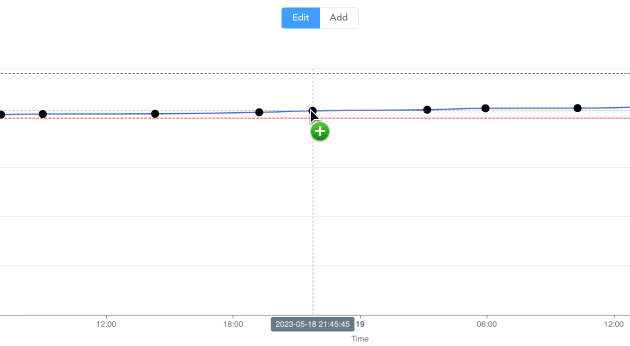
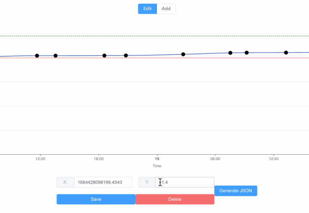
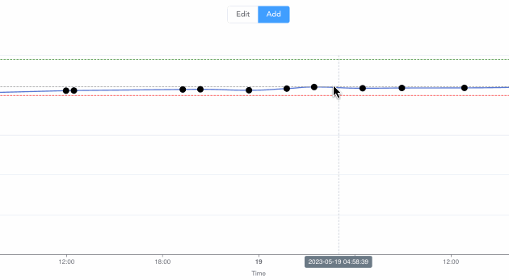

# 可拖拽图表

这个项目是一个使用 Vue.js 3 和 ECharts 构建的可拖拽图表样例。它提供了一个用户友好的界面，可以交互式地创建和编辑图表。

## 功能

- **拖动数据点**：通过在图表上拖动点轻松修改数据。
    
    

- **双击编辑数据**：双击任何数据点以打开一个对话框，用于精确数据输入。
    
    

- **点击添加数据点**：通过单击添加新的数据点到图表中。
    
    
    
- **随机数据生成**：按照特定趋势和范围生成随机数据点。

## 开始使用

要开始使用可拖拽图表样例，你可以克隆这个仓库到你的本地：

```
git clone git@github.com:codesssss/DraggableChart.git
```

然后，安装必要的依赖：

```
npm install
```

最后，你可以运行这个项目：

```
npm run serve
```

## 许可证

这个项目使用 MIT 许可证 - 详见 [LICENSE](LICENSE) 文件。
